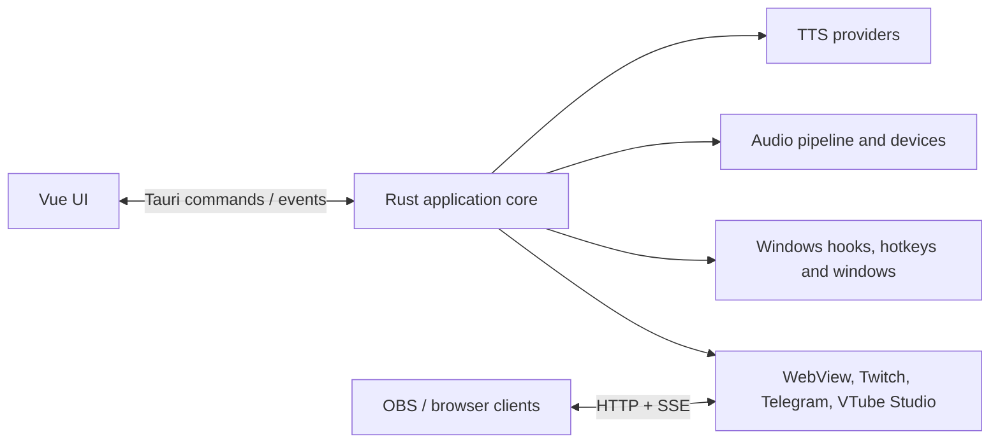

# Архитектура TTSBard

Этот документ описывает устойчивые границы системы и основные потоки данных.
Детали конкретных функций, полный список модулей и версии зависимостей следует
смотреть в исходном коде, `Cargo.toml` и `package.json`.

## Контекст системы

TTSBard — Windows desktop-приложение на Tauri 2. Интерфейс работает на Vue 3,
а системные интеграции, TTS, обработка аудио и фоновые сервисы находятся в Rust.



## Точки входа и запуск

- `src/main.ts` монтирует Vue-приложение из `src/App.vue`.
- `src-tauri/src/main.rs` передаёт управление библиотечному entry point.
- `src-tauri/src/lib.rs::run` создаёт Tauri builder, регистрирует shared state и
  команды frontend API.
- `src-tauri/src/setup.rs::init_app` связывает настройки, окна, event channels,
  keyboard hooks, playback и фоновые интеграции.

`lib.rs` и `setup.rs` являются composition root. Доменные правила не следует
добавлять туда, если у них есть подходящий service или модуль.

## Основные границы

| Область | Владелец | Назначение |
|---|---|---|
| UI | `src/components/`, `src/composables/` | Представление, формы и локальное состояние интерфейса |
| Команды | `src-tauri/src/commands/` | Тонкая граница вызовов Vue → Rust |
| События | `events.rs`, `event_loop.rs` | Внутреннее распределение событий и уведомления окон |
| Состояние приложения | `state.rs` | Общие runtime handles, сервисы, registry и hot-path state |
| Настройки | `config/` | Валидация, cache и сохранение пользовательских настроек |
| TTS | `tts/` | Провайдеры, их registry и единый контракт синтеза |
| Аудио | `audio/`, `signalsmith/`, `playback.rs` | Декодирование, DSP, очередь и вывод на устройства |
| Редактор | `editor.rs`, `preprocessor/`, `spellcheck.rs` | Подготовка текста, история и проверка орфографии |
| Окна и ввод | `window.rs`, `hotkeys.rs`, `soundpanel/` | Окна, глобальные клавиши и низкоуровневый ввод |
| Интеграции | `webview/`, `twitch/`, `telegram/`, `vtube_studio/` | Внешние протоколы и lifecycle подключений |

## Frontend ↔ backend

Frontend вызывает Rust через Tauri commands. Команда должна:

1. разобрать и провалидировать входные данные;
2. передать работу доменному сервису;
3. вернуть сериализуемый результат или безопасную ошибку.

Долгоживущие изменения состояния backend сообщает окнам через Tauri events.
Внутренний `AppEvent` не является публичным frontend-контрактом: его принимает
`EventHandler`, который обновляет backend и при необходимости рассылает внешние
события.

## Владение состоянием

`AppState` — основной runtime-контейнер. В нём находятся общие сервисы WebView,
Twitch, VTube Studio и editor, TTS registry, единый Tokio runtime, cancellation
token, кэши и небольшие runtime-флаги.

Отдельные Tauri-managed состояния используются там, где жизненный цикл уже
выделен из `AppState`: настройки, окна, playback, SoundPanel, история, вкладки и
Telegram.

Инварианты владения:

- доменный service владеет своими settings/status и предоставляет операции над
  ними;
- persisted settings проходят через `config/`, а не записываются компонентами
  напрямую;
- новые async-задачи используют общий runtime и общий shutdown token;
- mutex/RwLock guard нельзя удерживать во время сетевого запроса, аудиооперации
  или другого длительного `await`;
- UI не считается источником истины для состояния фонового сервиса.

## Основные потоки

### Синтез и воспроизведение

```text
UI / keyboard interception
  → Tauri command или AppEvent::TextReady
  → text preprocessing и prefix flags
  → выбранный provider из TtsProviderRegistry
  → audio decode / resample / DSP
  → PlaybackManager queue
  → выбранные audio devices
  → playback events в UI
```

Провайдер возвращает аудиоданные через общий TTS-контракт. Провайдер не должен
самостоятельно управлять окнами или очередью воспроизведения. Правила эффектов
и частоты дискретизации описаны в [аудиодокументации](../user/audio-effects.md).

### Рассылка текста и typing state

После принятия текста backend публикует типизированные события. WebView и Twitch
получают текст независимо; prefix flags могут отключить конкретного consumer.
Typing state также раздаётся отдельным consumers WebView и VTube Studio, чтобы
сбой одной интеграции не блокировал другую.

Контракты браузерного клиента описаны в [WebView](../integrations/webview.md) и
[SSE](../integrations/sse.md).

### Запуск и завершение

`setup.rs` восстанавливает настройки, создаёт каналы и запускает workers.
Синхронный main event loop работает в выделенном потоке, async-интеграции — на
общем Tokio runtime. При завершении cancellation token должен остановить
фоновые сервисы до уничтожения runtime и окон.

## Concurrency

- `std::sync::mpsc` связывает producers с главным обработчиком `AppEvent`.
- SoundPanel использует отдельный worker для чувствительного к задержкам ввода.
- Tokio tasks обслуживают сеть и другие async-интеграции.
- `Arc<Mutex<_>>`, `Arc<RwLock<_>>` и atomics применяются только для общего
  runtime state; предпочтительнее методы владельца, чем прямой доступ к полям.
- Блокирующее аудио, файловое или Windows API не должно выполняться на async
  executor без явной изоляции.

## Безопасность

- Секреты нельзя включать в логи, ошибки frontend или документы репозитория.
- Внешние URL и пользовательские пути валидируются на границе команды/service.
- WebView server применяет собственные правила bind address, token и CORS; см.
  [модель безопасности WebView](../integrations/webview.md#security-model).
- Windows hooks активируются только в требуемом режиме и освобождаются при
  shutdown.
- Новая интеграция должна иметь явные connect/disconnect операции, timeout и
  безопасное состояние после ошибки.

## Куда вносить изменения

| Изменение | Начальная точка |
|---|---|
| Новый frontend action | соответствующий composable и command в `commands/` |
| Новый TTS provider | `tts/engine.rs`, реализация provider, `tts/registry.rs` |
| Изменение аудиопайплайна | `audio/`, `playback.rs`, связанные roadmap/decision |
| Новое внутреннее событие | `events.rs` и исчерпывающий routing в `event_loop.rs` |
| Новая настройка | schema/validation/persistence в `config/`, затем UI |
| Новая внешняя интеграция | отдельный service с owned lifecycle и typed events |
| Изменение инициализации | `setup.rs`; `lib.rs` только для регистрации boundary |

Перед архитектурным изменением проверьте активный [roadmap](../roadmap/README.md)
и существующие [решения](../decisions/README.md). Команды проверки и сборки
находятся в [документации разработки](./README.md).
