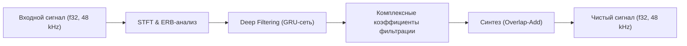
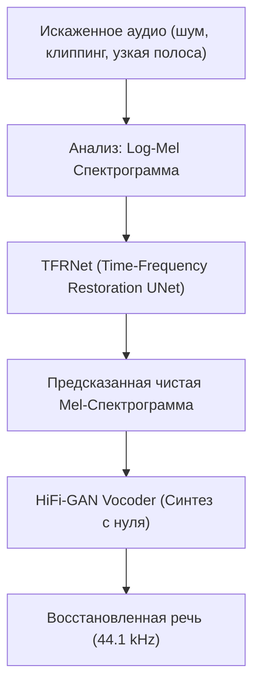

# Research: Обзор инструментов улучшения и восстановления речи (Speech Enhancement & Restoration)

**Дата:** 2026-07-13  
**Автор:** Antigravity (research)  
**Статус:** research note / обзор технологий  
**Связано:** [архитектура улучшения аудиопотока](./08-audio-stream-enhancement-research.md), [effects.rs](../../src-tauri/src/audio/effects.rs), [silero.rs](../../src-tauri/src/tts/silero.rs)

---

## 1. Введение

При работе с локальными TTS-системами (такими как Silero) разработчики часто сталкиваются с ограничениями качества выходного сигнала: низкая частота дискретизации (8–16–24 kHz), артефакты сжатия (MP3/OGG), бубнящий звук или фазовые искажения.

Для решения этих проблем используются два класса нейросетевых инструментов:
1. **Speech Enhancement (Шумоподавление и очистка):** Удаление шумов, реверберации и транзиентов при сохранении голоса.
2. **Speech Restoration / Bandwidth Extension (Восстановление и супер-разрешение):** Достраивание спектра, деклиппинг, устранение искажений кодеков и повышение частоты дискретизации (например, с 16 kHz до 48 kHz).

В этом исследовании мы подробно рассмотрим **DeepFilterNet** и **VoiceFixer**, а также проанализируем их современные альтернативы с точки зрения интеграции в проект **TTSBard**.

---

## 2. Глубокий анализ: DeepFilterNet vs. VoiceFixer

### 2.1 DeepFilterNet
[DeepFilterNet](https://github.com/Rikorose/DeepFilterNet) — это современный, ориентированный на производительность фреймворк для шумоподавления в реальном времени.

* **Архитектура:** Двухступенчатая обработка в частотной области. Сначала вычисляются грубые спектральные полосы (ERB — Equivalent Rectangular Bandwidth) для ослабления шума по энергетическому спектру. Затем применяется глубокая фильтрация (Deep Filtering) в комплексной области (STFT) для восстановления фазы и точечной фильтрации гармоник.
* **Философия:** Минимальные требования к вычислительным ресурсам, нулевая задержка (causal mode с lookahead всего 20 ms), пригодность для real-time общения.
* **Плюсы:**
  * Написан на **Rust** (ядро `libDF`), имеет готовый крейт на crates.io.
  * Чрезвычайно быстрый (RTF ~0.04 на одном ядре CPU).
  * Не требует GPU.
  * Работает напрямую с 48 kHz.
* **Минусы:**
  * Занимается **только** шумоподавлением и dereverb (эхо/реверберация).
  * Не умеет делать Super-Resolution (восстанавливать высокие частоты из 16 kHz).
  * Может ухудшать качество чистого TTS-звука (срезать согласные), если не настроить мягкое подавление (`atten_lim_db`).

---

### 2.2 VoiceFixer
[VoiceFixer](https://github.com/haoheliu/voicefixer) — это универсальный инструмент восстановления сильно деградировавшей речи, разработанный Haohe Liu.

* **Архитектура:** Состоит из двух модулей. Первый — **TFRNet** (Time-Frequency Restoration Network на базе ResUNet), который анализирует искаженную спектрограмму и предсказывает «чистую» спектрограмму. Второй — **HiFi-GAN Vocoder**, который генерирует абсолютно новый аудиосигнал на основе предсказанной спектрограммы.
* **Философия:** Офлайн-восстановление исторических записей, сильно зашумленных диктофонных дорожек или записей с клиппингом.
* **Плюсы:**
  * Делает всё сразу: убирает шум, реверберацию, клиппинг и достраивает частоты до 44.1 kHz (Bandwidth Extension).
  * Способен вернуть «студийное» звучание даже записям с частотой 8 kHz.
* **Минусы:**
  * Медленный (RTF > 5.0 на CPU, требует GPU для нормальной работы).
  * Из-за пересинтеза вокодером может незначительно менять тембр и индивидуальные особенности голоса (эффект «роботизации» или легкого сглаживания).
  * Написан исключительно на Python/PyTorch, нет простой Rust-интеграции.
  * Проект не развивается активно с 2022–2023 гг.

---

## 3. Аналоги и альтернативные инструменты

Ниже приведен список альтернативных инструментов, разделенных по категориям обработки звука.

### 3.1 Полноценное восстановление и супер-разрешение (Voice Restoration & BWE)

#### Resemble Enhance (⭐ Рекомендуется как современный аналог VoiceFixer)
* **GitHub:** [resemble-ai/resemble-enhance](https://github.com/resemble-ai/resemble-enhance)
* **Что делает:** Разделен на два модуля: быстрый Denoiser (очистка от шума и эха) и диффузионный Enhancer (супер-разрешение до 44.1 kHz).
* **Особенности:** На сегодняшний день это один из лучших open-source инструментов для достройки спектра (BWE). Denoiser-режим может работать на CPU в реальном времени, но полный pipeline с диффузией требует GPU. Лицензия Apache 2.0 позволяет коммерческое использование.

#### AudioSR
* **GitHub:** [haoheliu/AudioSR](https://github.com/haoheliu/AudioSR)
* **Что делает:** Специализированная диффузионная модель для супер-разрешения звука (любого типа — музыка, речь) до 48 kHz. Создана тем же автором, что и VoiceFixer.
* **Особенности:** Показывает невероятное качество апсэмплинга, восстанавливая мельчайшие детали. Однако, диффузия делает этот инструмент неприменимым для real-time задач без мощного GPU.

#### Neural Vocoders (BigVGAN / Vocos)
* **GitHub:** [NVIDIA/BigVGAN](https://github.com/NVIDIA/BigVGAN), [charactr-platform/vocos](https://github.com/charactr-platform/vocos)
* **Что делает:** Вокодеры преобразуют спектрограмму в волновую форму.
* **Особенности:** Вместо использования старого HiFi-GAN (как в VoiceFixer), современные конвейеры восстановления используют **Vocos** (очень быстрый, на базе ConvNeXt) или **BigVGAN** (высочайшее качество, устойчив к внеполосным сигналам). Их можно использовать для апсэмплинга, если подавать на вход интерполированную спектрограмму.

---

### 3.2 Шумоподавление (Speech Denoising / Dereverb)

#### Facebook Denoiser (Demucs Denoise)
* **GitHub:** [facebookresearch/denoiser](https://github.com/facebookresearch/denoiser)
* **Что делает:** Шумоподавление в реальном времени во временной области на базе архитектуры Demucs (U-Net с LSTM).
* **Особенности:** Доступны как казуальные (стриминг), так и неказуальные модели. Качество очистки очень высокое, но вычислительно модель тяжелее, чем DeepFilterNet. Написана на PyTorch.

#### DTLN (Dual-Signal Transformation LSTM Network)
* **GitHub:** [breizhn/DTLN](https://github.com/breizhn/DTLN)
* **Что делает:** Легковесное real-time шумоподавление.
* **Особенности:** Модель весит всего ~3 MB в формате ONNX. Отлично переносится в Rust через крейт `ort` (ONNX Runtime). Минус — жесткое ограничение внутренней частоты в 16 kHz.

#### RNNoise / nnnoiseless
* **GitHub:** [xiph/rnnoise](https://github.com/xiph/rnnoise), [RustAudio/nnnoiseless](https://github.com/RustAudio/nnnoiseless)
* **Что делает:** Классическое сверхлегкое шумоподавление (комбинация DSP и микро-GRU).
* **Особенности:** Потребление CPU близко к нулю. Полностью портировано на Rust (`nnnoiseless`). Однако, на чистом TTS-выводе оно бесполезно и может портить согласные.

---

### 3.3 Академические SOTA модели (High-Quality, Offline)

#### TF-GridNet
* **GitHub:** [microsoft/TF-GridNet](https://github.com/microsoft/TF-GridNet)
* **Что делает:** Новейшая модель от Microsoft для разделения и улучшения речи. Показывает топовые результаты на DNS-челленджах. Отличается высокой сложностью вычислений.

#### CMGAN (Conformal MetricGAN)
* **GitHub:** [ruoyiliu/CMGAN](https://github.com/ruoyiliu/CMGAN)
* **Что делает:** Генеративно-состязательная сеть, оптимизирующая метрику PESQ напрямую. Отлично подходит для очистки голоса от специфических шумов, но избыточна для интеграции в десктопное приложение.

---

## 4. Сравнение возможностей (Категоризация)

| Инструмент | Шумоподавление (Denoise) | Устранение эха (Dereverb) | Супер-разрешение (BWE) | Восстановление клиппинга |
|---|:---:|:---:|:---:|:---:|
| **DeepFilterNet** | ✅ Да | ✅ Да (DF3) | ❌ Нет | ❌ Нет |
| **VoiceFixer** | ✅ Да | ✅ Да | ✅ Да (до 44.1k) | ✅ Да |
| **Resemble Enhance** | ✅ Да | ✅ Да | ✅ Да (до 44.1k) | ❌ Нет |
| **AudioSR** | ❌ Нет | ❌ Нет | ✅ Да (до 48k) | ❌ Нет |
| **Facebook Denoiser** | ✅ Да | ❌ Нет | ❌ Нет | ❌ Нет |
| **DTLN** | ✅ Да | ❌ Нет | ❌ Нет | ❌ Нет |
| **RNNoise** | ✅ Да | ❌ Нет | ❌ Нет | ❌ Нет |

---

## 5. Сравнительный технический анализ для интеграции

> [!IMPORTANT]  
> Для desktop-приложения **TTSBard** критически важны: скорость обработки (минимальный RTF), размер поставляемого бинаря/модели, отсутствие необходимости в Python-окружении на машине пользователя и стабильность работы на CPU.

| Инструмент | Лицензия | RTF (на CPU) | Размер модели | Среда выполнения | Rust-интеграция | Оценка для TTS |
|---|---|---|---|---|---|---|
| **DeepFilterNet** | Apache 2.0 | **~0.04 (Очень быстро)** | ~3–9 MB | Rust-native / C | ⭐⭐⭐⭐⭐ (Отличная) | ⭐⭐⭐⭐ (Полезно для Silero Telegram) |
| **VoiceFixer** | MIT | ~10.0 (Медленно) | ~100 MB | Python + PyTorch | ⭐ (Сложно, subprocess) | ⭐⭐ (Слишком тяжело) |
| **Resemble Enhance** | Apache 2.0 | ~0.1 (Denoiser) / ~5.0 (Full) | ~200 MB | Python / ONNX | ⭐⭐⭐ (Возможно через ONNX `ort`) | ⭐⭐⭐⭐ (Лучший звук, но медленно) |
| **AudioSR** | MIT | ~15.0 (Крайне медленно) | ~1.2 GB | Python + PyTorch | ⭐ (Сложно) | ⭐ (Неприменимо в real-time) |
| **Facebook Denoiser** | CC-BY-NC 4.0 | ~0.5 (Средне) | ~80 MB | PyTorch | ⭐⭐ (Через LibTorch / ONNX) | ⭐⭐ (Тяжело, лицензия NC) |
| **DTLN** | MIT | ~0.2 (Быстро) | ~3 MB | ONNX | ⭐⭐⭐⭐ (Через крейт `ort`) | ⭐⭐⭐ (Ограничено 16 kHz) |
| **RNNoise** | BSD-3 | **<0.01 (Ультра-быстро)** | ~100 KB | Rust / C | ⭐⭐⭐⭐⭐ (Нативно) | ⭐ (Бесполезно для чистого TTS) |

---

## 6. Рекомендации по интеграции в TTSBard

С учетом архитектуры TTS-конвейера в [effects.rs](../../src-tauri/src/audio/effects.rs):

### Рекомендация 1: Локальное шумоподавление (DeepFilterNet)
Если целью является удаление артефактов и фонового шума (например, при захвате голоса пользователя или очистке пережатого MP3 от Silero Telegram bot):
* **Выбор:** **DeepFilterNet v3**
* **Как реализовать:** Подключить крейт `deep-filter` напрямую в [Cargo.toml](../../src-tauri/Cargo.toml). Интегрировать в [effects.rs](../../src-tauri/src/audio/effects.rs) в качестве опционального шага постобработки с ограничением подавления `atten_lim_db=10` (чтобы избежать «бульканья» на чистом TTS-звуку).

### Рекомендация 2: Апсэмплинг и улучшение тембра (Resemble Enhance / Vocos)
Если нужно превратить глуховатый 16 kHz / 24 kHz звук Silero в сочный 44.1/48 kHz:
* **Выбор:** Экспорт модели **Resemble Enhance (Denoiser)** или **Vocos** в формат **ONNX**.
* **Как реализовать:**
  1. Написать скрипт экспорта весов Resemble-Enhance в ONNX.
  2. Использовать крейт `ort` (ONNX Runtime Rust bindings) в Tauri для инференса на CPU.
  3. Это позволит получить высокое качество без необходимости тащить за собой PyTorch и Python-зависимости.

### Рекомендация 3: DSP-постобработка (Без нейросетей)
Для придания «студийности» TTS-звуку (добавления «воздуха» и плотности) часто достаточно классического звукового процессора:
* **Выбор:** Параметрический эквалайзер (High-shelf filter для частот выше 8 kHz) + мягкий компрессор (Ratio 2:1) + лимитер.
* **Плюсы:** RTF < 0.001, нулевой вес приложения, 100% стабильность, пишется на чистом Rust в [effects.rs](../../src-tauri/src/audio/effects.rs).

---

## 7. Следующие шаги для исследования

1. **Тест DSP-цепочки:** Добавить базовый эквалайзер и компрессор в [effects.rs](../../src-tauri/src/audio/effects.rs) и оценить субъективное улучшение Silero-голосов.
2. **Проверка `deep-filter` crate:** Попробовать скомпилировать тестовый бинарник на Rust с использованием `deep-filter` и прогнать через него WAV файлы, сгенерированные локальным Silero.
3. **ONNX-эксперимент:** Изучить возможность конвертации `resemble-enhance` в ONNX для потенциального использования в будущем.
